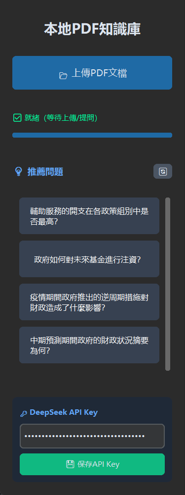
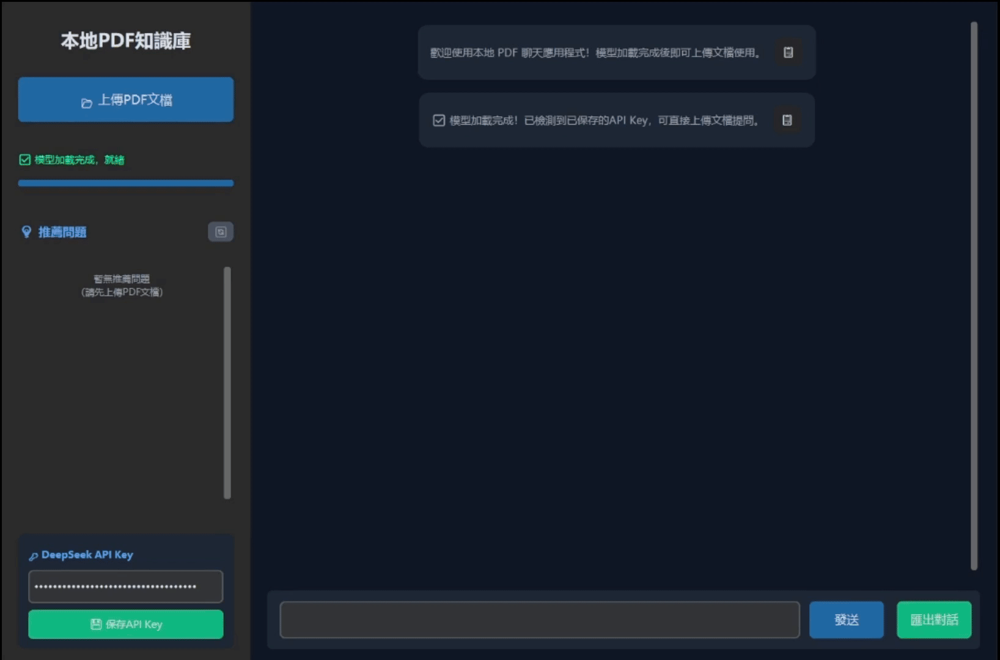
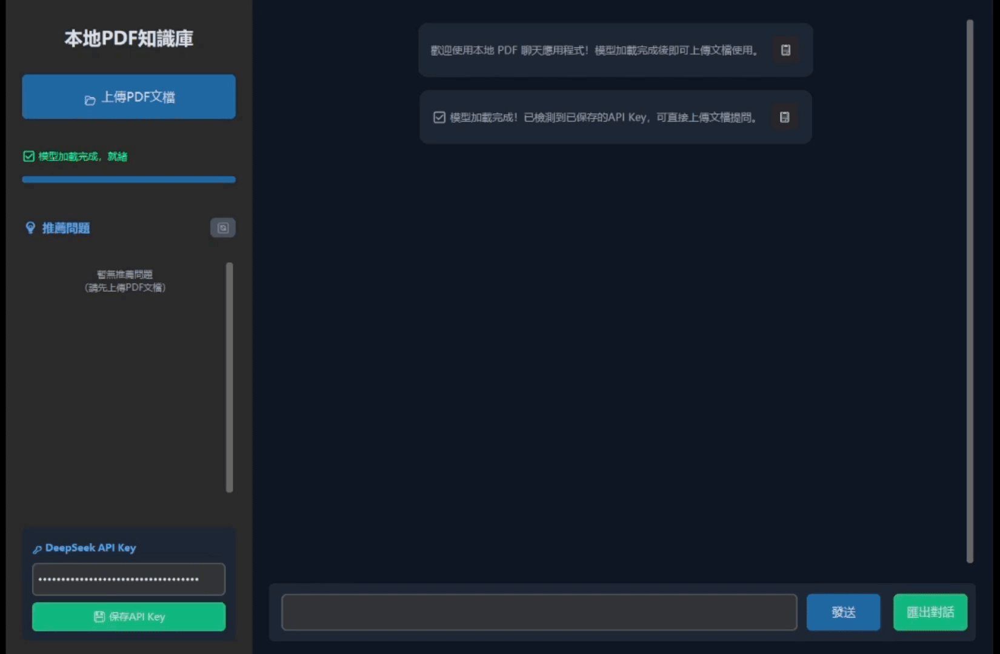
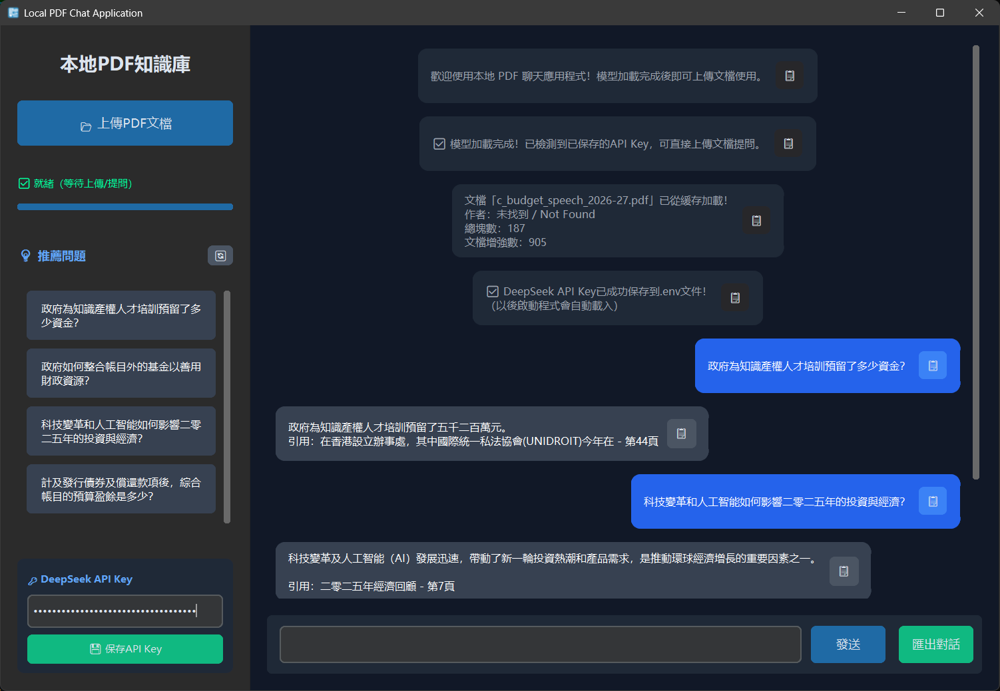
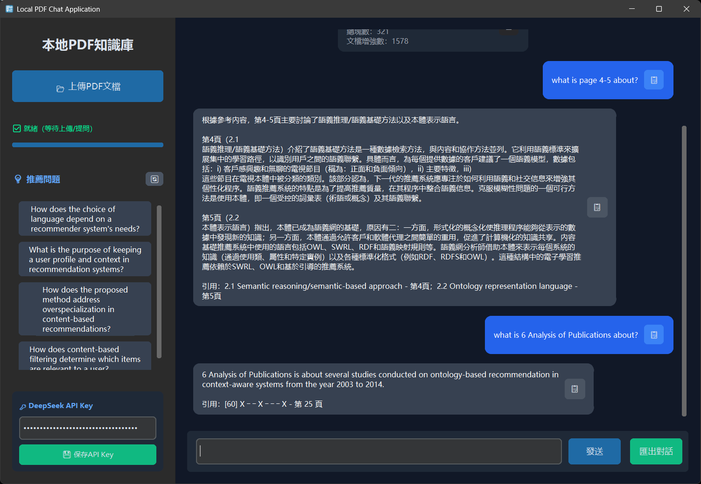
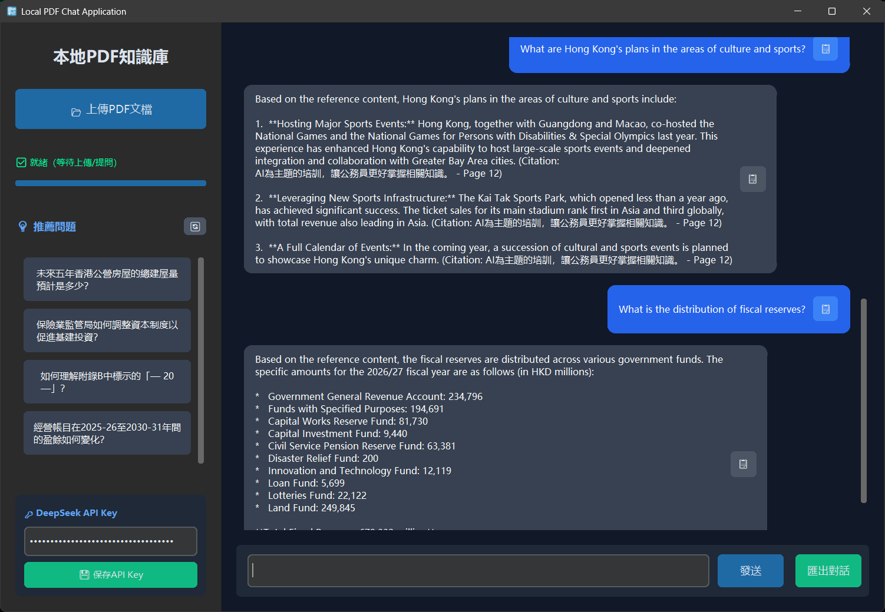
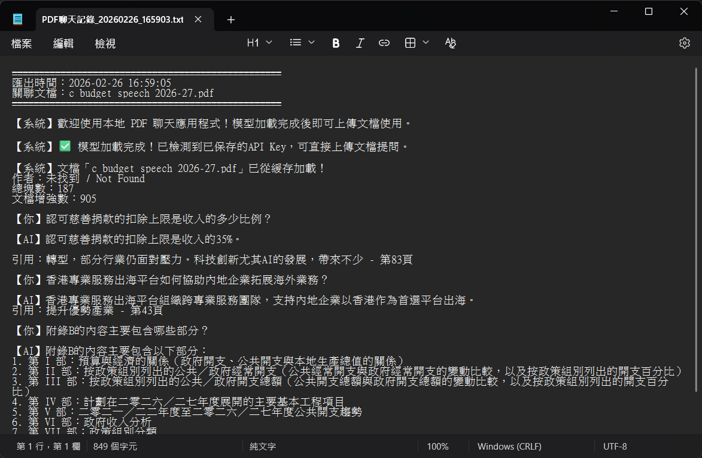

# Local PDF Chat Application (RAG-Powered)
A professional, bilingual (Chinese/English) desktop application for intelligent PDF document question-answering, built with Retrieval-Augmented Generation (RAG) technology.

---

## 📖 Project Overview
This project implements a **local, privacy-focused PDF chat system** that allows users to upload PDF documents and ask natural language questions about their content. The system combines advanced NLP techniques (vector search, reranking, virtual question augmentation) with LLM-powered generation to provide accurate, cited answers.

**Key Highlights**:
- Bilingual support (Chinese & English) for documents, queries, and answers
- Hierarchical vector indexing for precise retrieval
- Smart caching to avoid redundant processing
- Cross-language Q&A (e.g., ask Chinese questions about English PDFs)
- Streaming answer generation for better UX

---

## 🎯 Showcase
> **Modern Dark-Theme Interface**
>
> A professional desktop application built on `customtkinter`, supporting responsive layout and clear visual hierarchy.
>
> 

> **💡 Intelligent Recommended Questions**
>
> Automatically generates virtual questions based on PDF content, allowing users to quickly ask questions with one click, reducing exploration costs.
>
> 

> **Intelligent PDF Processing and Caching**
>
> - Supports layout-aware text extraction and metadata recognition (author/title/chapter);
> - Intelligent caching based on MD5 file hashes to avoid redundant processing;
> - Real-time progress tracking and visualization of processing status.
>
> | Processing Progress | Cache Hit |
> | :--- | :--- |
> |  |  |

> **Precise Q&A and Source Citation**
>
> Supports natural language questions and page/chapter-based targeted searches. All answers are marked with citation sources to ensure traceability.
>
> | General Q&A | Specified Page Number / Chapter |
> | :--- | :--- | 
> |  |  |
> * (Example: AI accurately answers and marks the cited chapter for a question targeting a specific page number)

> **🌍 Cross-language Intelligent Question Answering**
>
> Supports cross-language scenarios of "English document + Chinese question" and "Chinese document + English question," where AI accurately translates semantics and retains technical terms.
>
> 
> * (Example: Asking a question in Chinese on an English PDF, with AI providing a fluent Chinese answer)*

> **📤 Dialogue History Export**
> 
> Supports exporting complete dialogues as text/Markdown files, including timestamps and associated document information for easy review later.
>
> 

---

## 🛠️ Tech Stack
| Category          | Technologies                                                                 |
|-------------------|-----------------------------------------------------------------------------|
| **UI Framework**  | `customtkinter` (modern dark-themed desktop interface)                    |
| **NLP & Embeddings** | `sentence-transformers`, `cross-encoder`, `langchain-text-splitters`    |
| **Vector Database** | `FAISS` (local, high-performance vector storage)                          |
| **PDF Processing** | `pdfplumber` (text extraction with layout awareness)                      |
| **LLM Integration** | `OpenAI SDK` (compatible with DeepSeek API)                               |
| **Utilities**     | `python-dotenv` (env management), `threading` (async processing)         |

---

## ✨ Core Features
### 1. Smart PDF Processing
- **Layout-aware text extraction**: Preserves headers, footers, and page structure
- **Bilingual text splitting**: Uses language-specific separators for optimal chunking
- **Metadata extraction**: Automatically identifies author, title, and chapter headings
- **Virtual question generation**: Augments chunks with LLM-generated questions to boost retrieval

### 2. Advanced Retrieval System
- **Hierarchical vector index**: Organizes chunks by "Document Title → Chapter" for targeted search
- **Multi-dimensional scoring**: Combines semantic similarity, page/chapter weighting, keyword matching, and virtual question matching
- **Cross-encoder reranking**: Refines initial results with a lightweight reranker model
- **Context window expansion**: Automatically includes adjacent chunks for richer context

### 3. Intelligent Q&A
- **Cross-language support**:
  - Ask Chinese questions about English PDFs (auto-translation with semantic accuracy)
  - Ask English questions about Chinese PDFs
- **Source citation**: Answers include chapter/page references for traceability
- **Streaming output**: Real-time answer generation for improved UX
- **Special query handling**: Supports page-specific ("第3页", "page 5") and chapter-specific ("Chapter 2 last sentence") queries

### 4. Performance Optimization
- **Smart caching**: Saves processed chunks and vector indexes to avoid redundant work
- **Async processing**: Uses threading to keep UI responsive during PDF processing
- **Progress tracking**: Visual progress bar with step-by-step status updates

---

## 🚀 Installation & Usage
### Prerequisites
- Python 3.9+
- A DeepSeek API key (free tier available at [DeepSeek Platform](https://platform.deepseek.com/))

### Step 1: Clone the Repository
```bash
git clone https://github.com/LutherYTT/Local-PDF-Chat-Application-RAG-Powered-.git
cd pdf-rag-chat
```

### Step 2: Install Dependencies
```bash
pip install -r requirements.txt
```

### Step 3: Configure API Key
1. Launch the application (see Step 4)
2. Enter your DeepSeek API key in the left sidebar
3. Click "💾 保存API Key" (saved to `.env` for future use)

### Step 4: Run the Application
```bash
python main.py
```

### How to Use
1. **Upload a PDF**: Click "📂 上傳PDF文檔" and select your file
2. **Wait for processing**: The app will extract text, build indexes, and generate virtual questions
3. **Ask questions**: Type your question in the input box (or use recommended questions)
4. **Get answers**: The AI will generate a cited answer based on the PDF content
5. **Export chat**: Click "匯出對話" to save the conversation history

---

## 📁 Project Structure
```
pdf-rag-chat/
├── main.py                 # Application entry point
├── ui/
│   └── app.py             # CustomTkinter UI implementation
├── core/
│   ├── pdf_processor.py   # PDF parsing, text splitting, virtual question generation
│   ├── vector_store.py    # Hierarchical FAISS index, multi-dimensional retrieval, reranking
│   ├── rag_chain.py       # LLM prompt engineering, streaming answer generation
│   ├── file_cache.py      # Caching for processed chunks and indexes
│   ├── question_generator.py  # Virtual question generation via LLM
│   └── utils.py           # Bilingual query parsing, text utilities
├── data/                  # Auto-created: stores indexes, uploads, cache
└── requirements.txt       # Project dependencies
```

---

## 🔍 Technical Deep Dive
### Hierarchical Retrieval Flow
1. **Query Parsing**: Extracts page/chapter references from the user's question
2. **Targeted Search**: If a document/chapter is mentioned, searches only that subset
3. **Global Fallback**: If no specific section is mentioned, searches the entire document
4. **Multi-dimensional Scoring**: Weights results by semantic similarity, page/chapter match, keyword overlap, and virtual question match
5. **Reranking**: Uses a cross-encoder to refine the top results
6. **Context Expansion**: Adds adjacent chunks to ensure full context

### Caching Strategy
- **File Hash**: Uses MD5 hash of the PDF file to detect duplicates
- **Cached Data**: Saves processed chunks, vector indexes, and metadata
- **Cache Validation**: Checks index integrity on load; rebuilds if corrupted

---

## 🎯 Future Enhancements
- [ ] Support for more document formats (Word, PowerPoint, TXT)
- [ ] Conversation history persistence (save/load chat sessions)
- [ ] Local LLM integration (e.g., Llama 3, Qwen) for fully offline use
- [ ] Batch processing for multiple PDFs
- [ ] Advanced visualization (PDF viewer with highlighted answer sections)

---

## 📬 Contact
Feel free to reach out for questions, collaborations, or job opportunities!
- **GitHub**: [github.com/LutherYTT](https://github.com/LutherYTT/)
- **Email**: luyuktong@gmail.com

---

## 📄 License
This project is for demonstration purposes only. Please respect the terms of service of the underlying APIs and libraries.

---
